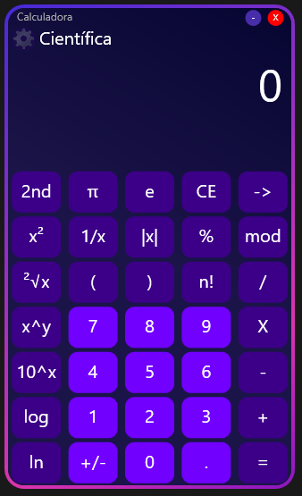

# Scientific Calculator 🧮

Welcome to the C# WPF Scientific Calculator project! 💻 This is a desktop application designed to perform various scientific calculations with a clean, modern user interface built using Windows Presentation Foundation (WPF).
This proyect was made just for fun and learning :)

---

## 📸 Screenshot



---

## ✨ Features

This calculator currently supports the following operations:

* Basic Arithmetic: Addition (`+`), Subtraction (`-`), Multiplication (`X`), Division (`/`)
* Number Input: `0-9` and decimal point (`.`)
* Clear Entry (`CE`) and Backspace (`->`)
* Constants: Pi (`π`)
* Standard Functions: Square (`x²`), Reciprocal (`1/x`), Square Root (`²√x`), Power (`x^y`), 10 to the power of x (`10^x`)
* Logarithmic Functions: Logarithm base 10 (`log`), Natural Logarithm (`ln`)
* Other Operations: Percentage (`%`), Sign Change (`+/-`)
* Equals (`=`) to compute the result.

---

## 🚧 Currently Unimplemented Features

Please note that the following functions are **visible on the UI but are not yet functional**:

* `2nd` (Secondary function toggle)
* `|x|` (Absolute Value)
* `(` and `)` (Parentheses)
* `mod` (Modulo operation)
* `e` (Euler's number constant)
* `n!` (Factorial)

Contributions to implement these are welcome!

---

## 🛠️ Technologies Used

* **Language:** C#
* **Framework:** Windows Presentation Foundation (WPF)
* **IDE:** Visual Studio (Recommended)

---

## 🚀 Getting Started

To run this project locally:

1.  **Clone the repository:**
    ```bash
    git clone [https://github.com/YOUR_USERNAME/YOUR_REPOSITORY_NAME.git](https://github.com/YOUR_USERNAME/YOUR_REPOSITORY_NAME.git)
    ```
    *(Replace `YOUR_USERNAME/YOUR_REPOSITORY_NAME` with your actual GitHub username and repository name)*
2.  **Open the solution:** Navigate to the cloned directory and open the `.sln` file using Visual Studio.
3.  **Build the solution:** Press `Ctrl+Shift+B` or go to `Build > Build Solution`.
4.  **Run the application:** Press `F5` or click the `Start` button in Visual Studio.

---
